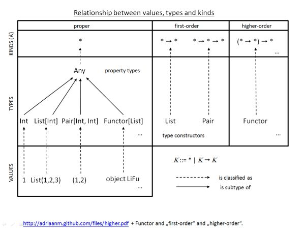
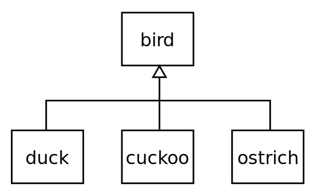

class: center, middle

.big.darkblue.whiteBack[Abstractions]

---

# Precise, Lawful Abstractions

--


  **Abstractions** &mdash; abstracting away various amounts of detail

--

  **Algebraic** &mdash; adhering to algebraic laws

--

```scala
    1+(2+3) ≡ (1+2)+3
```

---
# Sum of a List of Integers

--
```scala
scala> val s = List(1,2,3).sum
```
--

Spoilsport!

--
```scala
scala> def sum(l : List[Int]) = l.reduce(_ + _)
sum :: List[Int] => Int                          //oh really? Yes, this isn't scala.
```
--
Here,
```scala
_ + _
```
is just some syntactic sugar and is the same as
--

```scala
(a,b) => a + b
```
which in turn is the same as
--

```scala
(a:Int, b: Int) => a + b
```

---
# Only Ints?

--
```scala
scala> sum(List(1,2,3))
res0: Int = 6
```
--
```scala
scala> sum(List(1.0, 2.0, 3.0))
<console>:9: error: type mismatch;
found   : Double(1.0)
required: Int
```
--

This should be possible.

--

In scala we could use a **Type class** .code[Numeric] to extend our reach

--
```scala
scala> def sum[A: Numeric](l : List[A]) =

                 l.reduce((a:A, b:A) => implicitly[Numeric[A]].plus(a,b))
```

And that is what .code[List(1.0, 2.0, 3.0).sum] from the standard library does to cover numeric types.

---

#Are we there yet?

```scala
scala> sum(List(1.0, 2.0, 3.0))
res1: Double = 6.0
```
--

Nice! So what about

--
```scala
scala> sum(List("1", "2", "3"))
```
--

```scala
<console>:35: error: could not find implicit value for evidence parameter
  of type Numeric[String]
                   sum(List("1", "2", "3"))
                      ^
```

**Type-error!**

--

Wat?  .code["1" + "2"]  and even .code["1" + 2] is allowed!


---
# Step Back

--
### Values
```scala
1, "1", 1.0, Cat("Siamese"), List(1), (x:Int) => x * 2, Map("€" -> 100)
```
--
### Types
```scala
Int, String, Double, Cat, List[Int], Function1[Int, Int], Map[String, Int]
```
--
### Kinds
```sh
  *, *, *, *,      * → *,      * → * → *,     * → * → *
  proper types (*) unary-type-constructor (* → *) binary-type-constructor (* → * → *)
```

---

#Draw it



And now shelve them for later.

---
#Polymorphism

--
### Subtype Polymorphism (Subclasses) .small[]

--
### Parametric Polymorphism
```scala
// head :: {∀ a in A} List[A] => A         //neither scala nor haskell
def head[A](xs: List[A]) : A = xs(0)
```

--
### Ad-hoc Polymorphism (Type classes<sup>*</sup> &ndash; Unlike classes you know off )

*Ad-hoc here is not a pejorative*. It is monkey-patching (what?) for the sane<sup>**</sup>.


<hr>
<sup>*</sup> [Type classes](http://typelevel.org/cats/typeclasses.html)

<sup>**</sup> [Monkey Patching, Duck Typing and Type Classes](http://jsuereth.com/2010/07/13/monkey-patching-scala.html)


--

 Examples: .code[Numeric], .code[Ordering], .code[Equal], .code[Show], .code[Read] etc.


---
# Errr&hellip; where were we?


--
```scala
scala> def sum[A: Numeric](l : List[A]) =

                   l.reduce((a:A, b:A) => implicitly[Numeric[A]].plus(a,b))
scala> sum(List("1", "2", "3"))
```
--

```scala
<console>:35: error: could not find implicit value for evidence parameter
  of type Numeric[String]
                   sum(List("1", "2", "3"))
                      ^
```
--
.code[Numeric] didn't bring us very far.

We want to .big-code[abstract] over the .big-code[+], a binary operator/method/function for .underline[many types] not just types that are .code[Numeric] in nature.


---

# Semigroup<sup>*</sup> &ndash; Algebra


.lineheightBig[A Semigroup is an .underline[algebraic structure] consisting of a .big-code[set] together with an .big-code[associative binary operation].]

--

In mathematics&hellip; and almost very precise.

--

Because we are brave we jump ahead and *abstract* over many binary operators for many types (sets).

--

#### Can we do better?

--

&nbsp;

&nbsp;

&nbsp;

&nbsp;

<hr>
<sup>*</sup> We skipped .code[Magma]

---

# Semigroup &ndash; Properties

There exists some type .code[A] such that it has a binary operation .code[op] such that

--
#### Totality (Closure)

```hs
1. op :: A → A → A
```

--

#### Associativity

```hs
2. op(op(a,b), c) ≡ op(a, op(b,c))

2. (a `op` b) `op` c ≡ a `op` (b `op` c)
```

--

Two and only two.

--

.code[Magma] needs just one - Totality.

--

Hence .code[Magma] is more abstract and more general i.e. it can be applied more universally than a .code[Semigroup].

--

.red[The .step[more specific an abstraction] is, the more you can derive from it  i.e. .step[more can be done] with that abstraction, but it becomes .step[less universally applicable] &mdash; win some; loose some.]


---

# Semigroup &ndash; Type class     ( cue - DEMO! )

How do we capture this in Scala?

--

```scala
trait Semigroup[A] {        //semigroup for a type A

*  def op : A => A => A      //requires a binary operation that's total

}
```

Semigroup is an abstraction that we capture as a Type class. [.step[Step 1]]

--

### How do we put it to use?

```scala
*scala> def sum[A: Semigroup](l : List[A]) =
          l.reduce((a:A, b:A) =>
*            implicitly[Semigroup[A]].op(a)(b))

            //note op(a)(b) (curry) instead of op(a,b) (tupled)
```

That is an example of a _Bounded Parametric Polymorphism_. We bind the type .code[A] to a certain bound - in this case the .code[Semigroup]  [.step[Step 2]]


---

# Making a Type a Semigroup

--

```scala
implicit object StringSG extends Semigroup[String] { //only ever require this one
  def op = a => b => a + b  //look! the promise of inference :)
}
```

Henceforth, .code[String] has a .code[Semigroup]. That .big-code[implicit] keyword is very important. [.step[Step 3]]


--

```scala
scala> sum(List("1","2","3"))
res3: String = 123
```

---

# Yes!

--

```scala
scala> sum(List(1,2,3))
<console>:11: error: could not find implicit value for evidence parameter &#10558;
&#10559; of type Semigroup[Int]
              sum(List(1,2,3))
                 ^
```

### Oh S*&#9760;&#9874;!

--

```scala
implicit object IntSG extends Semigroup[Int] {
    def op = a => b => a + b
}
```

--

```scala
scala> sum(List(1,2,3))
res6: Int = 6
```

--

### Phew!

---

# Totality  (Closure)

--

### That's a compiler's job: day in and day out

--

### It is better than any amount of tests we'd ever write.

--

### Types are propositions!<sup>1</sup> and that also applies to partial languages<sup>2</sup>

--

### Parametricity or Reynold's abstraction theorem<sup>3</sup>

--

<p>&nbsp;</p>
<p>&nbsp;</p>

<hr>
<sup>1</sup>[Propositions as Types](http://homepages.inf.ed.ac.uk/wadler/papers/propositions-as-types/propositions-as-types.pdf)
<sup>2</sup>[Fast and Loose Reasoning is Morally Correct](http://www.cse.chalmers.se/~nad/publications/danielsson-et-al-popl2006.pdf)
<sup>3</sup>[Theorems for free](http://ttic.uchicago.edu/~dreyer/course/papers/wadler.pdf)


---

# Associativity &nbsp;&nbsp;&nbsp;&nbsp;&nbsp; (x ⊹ y) ⊹ z ≡ x ⊹ (y ⊹ z)

--

How do we prove this? First let us capture it.

```scala
object SemigroupLaws {

  def associativity[A: Semigroup : Equal](a: A, b: A, c: A): Boolean = {

    val sg = implicitly[Semigroup[A]]
    val eq = implicitly[Equal[A]]

*    eq.eq(sg.op(sg.op(a)(b))(c), sg.op(a)(sg.op(b)(c)))

  }

}

```

This is too much code. We can make it more compact but then we'll be lost in syntax.

--

```scala
object SemigroupLaws {
  def associativity[A: Semigroup : Equal](a: A, b: A, c: A): Boolean = {
*    ((a |+| b) |+| c) ===  (a |+| (b |+| c))
  }
}

```

Yes, it is possible. Pretend you didn't see that.


---

# Property Based Testing

We use .code[scalacheck] to do the needful.

--

```scala
import org.scalacheck._, Prop.forAll

object SemigroupProps {
  def laws[A: Semigroup: Equal: Arbitrary] = new Properties("semigroup") {
*    property("associativity") = forAll(SemigroupLaws.associativity[A] _)
  }
}
```

.big-code[A] needs to have .code[Semigroup], .code[Equal] and .code[Arbitrary] type classes defined.
--

```scala
scala> val dp = Test.Parameters.default

*scala> SemigroupProps.laws[Int].check(dp)                           //runs 100
+ semigroup.associativity: OK, passed 100 tests.

scala> SemigroupProps.laws[Int].check(dp.withMinSuccessfulTests(1000000))
+ semigroup.associativity: OK, passed 1000000 tests.
```


---

# Recap

1. A .code[type] can have a .code[Semigroup] defining an associative binary operation.

2. We can define a .code[sum] that can reduce a .sum[list] of values of that .code[type] to a single value.

3. We can very .underline[easily test] if a type posing as a .code[Semigroup] is a _lawful_ .code[Semigroup].

4. .underline[Many many types] have a semigroup: .code[List] also has a .code[Semigroup] such that

   .code[sum( List( List(1,2,3), List(4,5,6) ) ) ≡ List(1,2,3,4,5,6)]

---

# Revelation

--

```scala
scala> sum( List(1,2,3,4,5) )( lift[Int](_ ∗ _) )
res2: Int = 120
```

Cool!

--

.code[Int] has many Semigroups. For example, one with .code[+] and one under .code[&lowast;].


*Consequence*: You need to specify which one you want. In _Scala_ this is easier than in _Haskell_.

---

# Done?

--

```scala
scala> sum(List())

java.lang.UnsupportedOperationException: empty.reduceLeft
```

--

# Piyush, you should have done TDD!


---

# Empty Lists

--

What happens if the list is empty?

```scala
def sum[A : Semigroup](l: List[A]) : A = l.reduce(_ |+| _)
```

--

Or, do you prefer?

```scala
scala> def sum[A: Semigroup](l : List[A]) =
          l.reduce((a:A, b:A) =>
            implicitly[Semigroup[A]].op(a)(b))
```

--

We should be using a .code[fold] instead of .code[reduce]. But .code[fold] requires a start value also called the .code[zero] or .code[identity]


---

# Monoid - I

--

Monoids add the requirement of .big-code[identity] on top of a .big-code[Semigroup].

--


```scala

trait Monoid[A] extends Semigroup[A] {
  def identity : A
}
```

--

# Identity element

Not to be confused with the _Law of identity_, principle of logic stating that an object is the same as itself.

.code[
There exists an element .big-code[e] in .big-code[S] such that

for every element .big-code[a] in .big-code[S], the equations .big-code[e ⊹ a = a ⊹ e = a] hold.
]

--

Example,

.code[0 + 2 = 2 + 0 = 2] or .code[1 &lowast;  2 = 2 &lowast; 1 = 2]

---


# Monoid - II

```scala
trait Monoid[A] extends Semigroup[A]  {
*  def identity : A
  def ∅ = identity
}
```
--

```scala

def lift[A: Semigroup](a: A) : Monoid[A] = new Monoid[A] {
      def identity = a
      def op = Semigroup[A].op
}

implicit val strs = lift("")     // and we have a string monoid!

```

---

# Monoid Laws

```scala
object MonoidLaws {
  def associativity ...

  def leftIdentity[A: Monoid : Equal](a: A): Boolean = {
    (Monoid[A].∅ |+| a) === a
  }

  def rightIdentity[A: Monoid : Equal](a: A): Boolean = {
    (a |+| Monoid[A].∅ ) === a
  }
}
```
--

```scala
object MonoidProps {
  def laws[A: Monoid: Equal: Arbitrary] = new Properties("monoid") {
    property("associativity") = forAll(MonoidLaws.associativity[A] _)
    property("left identity") = forAll(MonoidLaws.leftIdentity[A] _)
    property("right identity") = forAll(MonoidLaws.rightIdentity[A] _)
  }
}
```
--

```scala
scala> MonoidProps.laws[Int].check(dp)
+ monoid.associativity: OK, passed 100 tests.
+ monoid.left identity: OK, passed 100 tests.
+ monoid.right identity: OK, passed 100 tests.
```

---

# Sum again

--

```scala
def sum[A : Monoid](l: List[A]) : A = l.foldRight(Monoid[A].∅)(_ |+| _)
```
--

```scala
scala> sum(List[Int]())
res1: Int = 0

scala> sum(List[String]())
res2: String = ""
```

--

Mult?

--

```scala
scala> sum(List[Int]())(Monoid.lift(1)(Semigroup.lift(_ * _)))
res2: Int = 1

scala> sum(List[Int](1,2,3,4,5))(Monoid.lift(1)(Semigroup.lift(_ * _)))
res3: Int = 120

scala> implicit val mult = Monoid.lift(1)(Semigroup.lift(_ * _))
mult: goto.Monoid[Int] = goto.Monoid$$anon$1@1d105bdb

scala> sum(List[Int](1,2,3,4,5))
res5: Int = 120
```

---

# Can we do any better?

--

```scala
scala> sum(Array(1, 2, 3))
<console>:21: error: type mismatch;
 found   : Array[Int]
 required: List[?]
              sum(Array(1, 2, 3))
```

How about a Tree instead of an Array?

--

```scala
sealed trait Tree[A]
case class Leaf[A](a: A) extends Tree[A]
case class Fork[A](l: Tree[A], r: Tree[A]) extends Tree[A]
```


---

# Type constructors

--

## Unary type constructor

#### .code[List[_]] is a special type and it's kind is &lowast; → &lowast;

#### .code[List[Int]] is a proper type as it is complete and it's kind is &lowast;

--

## Binary type constructor

#### .code[Map[_,_]] is a special type and it's kind is &lowast; → &lowast; → &lowast;

#### .code[Map[String, Int]] is a proper type and it's kind is &lowast;

---

# Higher Kinded Types

--

#### .code[Functor[F[_]]] is a higher order type and it's kind is: (&lowast; → &lowast;) → &lowast;

Those brackets aren't an afterthought. Difference between (&lowast; → &lowast;) → &lowast; and &lowast; → (&lowast; → &lowast;)

--

#### .code[Functor[List[Int]]] is a proper type.

--

We require one such higher kinded type to round off our .code[sum].

---

# .code[Foldable], a Higher Kinded Type and a Type class

Abstracts over containers which can be “folded” into a summary value.

--

```scala
trait Foldable[F[_]] {
*  def fold[A : Monoid](m: F[A]): A
}
```

--

```scala
implicit val list : Foldable[List] = new Foldable[List] {
  override def fold[A: Monoid](m: List[A]) = m.fold(Monoid[A].∅)(_ |+| _)
}

implicit val tree : Foldable[Tree] = new Foldable[Tree] {
  override def fold[A: Monoid](m: Tree[A]) = m match {
              case Leaf(a) => a
              case Fork(l, r) => (fold(l) |+| fold(r))
  }
}

```

--

For trees we don't require the monoid identity &mdash; why not?


---

# Sum now?

--

```scala
def sum[F[_]: Foldable, A : Monoid](l: F[A]) : A = Foldable[F].fold(l)
```

--

```scala
scala> sum(Tree(1,2,3,4,5,6))
res9: Int = 21
```
--

Does .code[Foldable] have laws?

--

Yes, left fold should be consistent with right fold. We skip that for now .. but these laws are just as verifiable and need to be met for a .underline[legal] .code[Foldable].


---

# Is that it?

--

### No! What if we could sum(List('a','b','c'))  == 294

--

### .code[Foldable] exposes .code[foldMap] that maps value to another type and then folds.

```scala
trait Foldable[F[_]] {

*   def foldMap[A, B : Monoid](m: F[A])(f: A => B): B

   def fold[A : Monoid](m: F[A]): A = foldMap(m)(x => x)
}
```

--


### Strictly more powerful than the fold we used before.

--

### And .code[Foldable] buys us .code[any], .code[all], .code[size], .code[intercalate], .code[splitWith], .code[minimum], .code[maximum] etc. for free.

---

# Did you know that Maps are Monoids if the values are a Semigroup?

--

```scala
implicit def MapMonoid[K, V: Semigroup]  = lift(
          Map[K,V](),
          (m1: Map[K, V], m2: Map[K, V]) => {
              m1.foldLeft(m2){
                      case (to,(k,v)) =>
                        to.updated(k, to.get(k).map(Semigroup[V].op(_)(v)).getOrElse(v))
    }
})
```

--

```scala
scala> val jan = Map("€" -> 100, "$" -> 900, "#" -> 300)

scala> val feb = Map("€" -> 900, "#" -> 500)

scala> sum(List(jan, feb))
res0: scala.collection.immutable.Map[String,Int] = Map(€ -> 1000, # -> 800, $ -> 900)
```
---

# Explore the Goodness

### Group, Lattice, Ring, Functor, Applicative, Monad, Traversable, Comonad, Zippers, Lenses, etc.

### Scalaz, Cats, Shapeless, Spire etc.

### What is behind CRDTs?


---

# Key Takeaways

--

### Precise abstractions - mathematical preciseness
--

### More general to more specific

--

### Properties based testing

--

### Types, Kinds, Type classes, Parametric Polymorphism, etc.

--

### Write less, do more &mdash; refactor to remove repeated boiler plate code

--

### Composition: the way from small things to BIG things


---

## Keep Exploring

  What is parametricity, universal quantification, Types Driven Development, Dependent Types etc.

--

## References

0. [Programming with Algebra](https://developer.atlassian.com/blog/2016/03/programming-with-algebra/)
1. [Functional Programming in Scala](http://www.manning.com/bjarnason/)
2. [Theorems for free](http://ttic.uchicago.edu/~dreyer/course/papers/wadler.pdf)
3. [Propositions as Types](http://homepages.inf.ed.ac.uk/wadler/papers/propositions-as-types/propositions-as-types.pdf)
4. [Fast and Loose Reasoning is Morally Correct](http://www.cse.chalmers.se/~nad/publications/danielsson-et-al-popl2006.pdf)
5. Wikipedia .. for Semigroups, Monoids, Polymorphism, Abstraction principle, and many more.
6. [Typeclassopedia in Haskell](http://www.haskell.org/haskellwiki/Typeclassopedia)
7. [Categories for the Working Programmer](http://www.infoq.com/presentations/categories-functional-programming)
8. [Constraints Liberate, Liberties Constrain](https://www.youtube.com/watch?v=GqmsQeSzMdw)


---


### Code & Blog

http://github.com/ppurang/algebraic-abstractions

http://piyush.purang.net/blog


---

# Thank You!

Extend your toolbox. Types, Functional Programming, Abstract Algebra and Category Theory for profit.


## Attributions

1. Title page image: .attr["Programming with Algebra - https://developer.atlassian.com/blog/2016/03/programming-with-algebra/]
2. Subtype polymorphism image: .attr["Inheritance". Via Wikipedia - http://en.wikipedia.org/wiki/File:Inheritance.svg#mediaviewer/File:Inheritance.svg]
3. Values, Types, Kinds: .attr["Scala: Types of a higher kind" - http://blogs.atlassian.com/2013/09/scala-types-of-a-higher-kind/]
